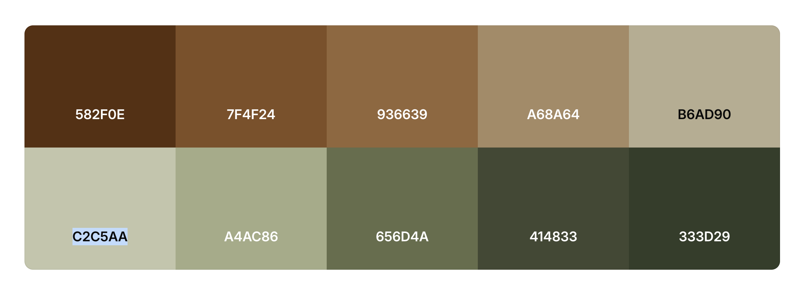

# ACCOMPLISHMENT TRACKER
---
** WHERE IT MAY NOT BE AN ACCOMPLISHMENT TO THEM, BUT IT WAS AN ACCOMPLISHMENT TO YOU**
---
*Keep track of every accomplishment you accomplish. Check out your friends accomplish and adopt it to try to achieve the similar heights*

## SO FAR
-   Click the Sign In Button
-   Click the Sign Up Button
-   Click the "View Accomplishment" Button on first card

## Acknowledgments 
-   [Eagle Logo](https://www.pexels.com/search/eagle/)
-   [Playstation Controller](https://www.pexels.com/photo/blue-sony-ps4-controller-on-black-surface-459762/)
-   [Book Picture](https://www.pexels.com/photo/pages-on-an-opened-book-415071/)
-   [Paragliding](https://www.pexels.com/photo/statue-2528414/)
-   [Car Trouble](https://www.pexels.com/photo/a-woman-standing-by-a-car-12956065/)
-   [Peru](https://www.pexels.com/photo/macchu-picchu-peru-259967/)
-   [RV](https://www.pexels.com/photo/white-car-traveling-near-trees-during-daytime-24698/)
-   [Knitting](https://www.pexels.com/photo/pancake-with-sliced-strawberry-376464/)
-   [Pancakes](https://www.pexels.com/photo/pancake-with-sliced-strawberry-376464/)

### Color Pallete
[Color Pallete](https://coolors.co/palettes/trending)

a. What could you have done differently during the planning stages of your project to make the execution easier?

The things I would have done differently during the planning stages of my project to make execution easier is break down the tasks more into shorter "sprints".

c.What would you add to or change about your website if given more time ?

I would like to add more pages to the "View Accomplishment" buttons and I wouldve like to add a page to show what the "Adopt" button would have looked like.